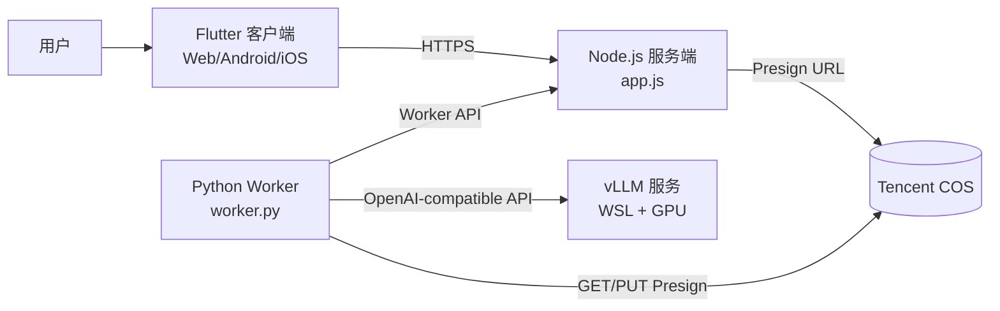
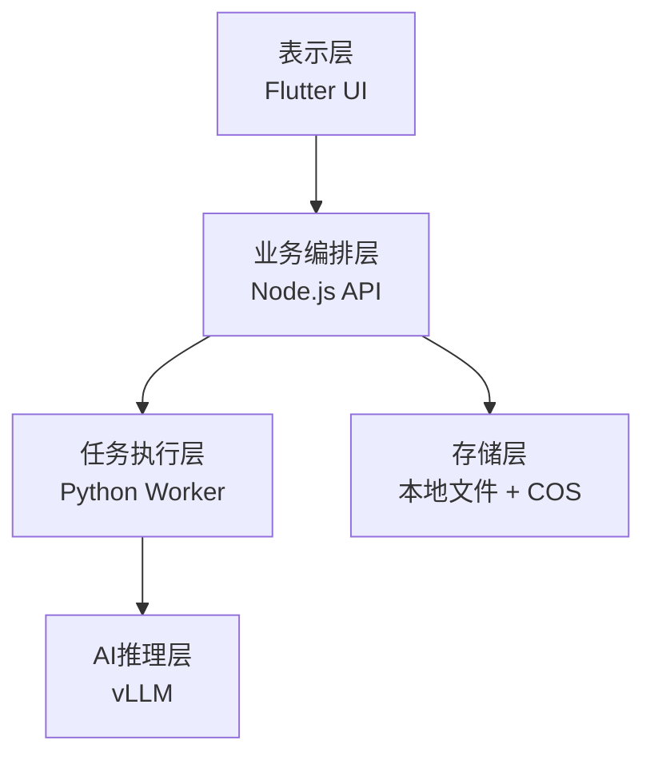
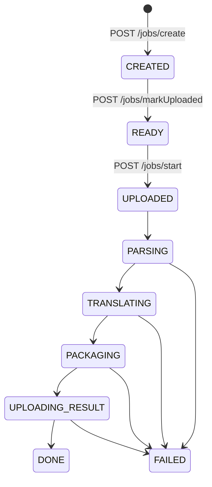
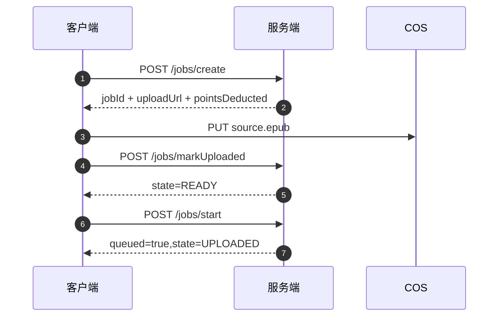
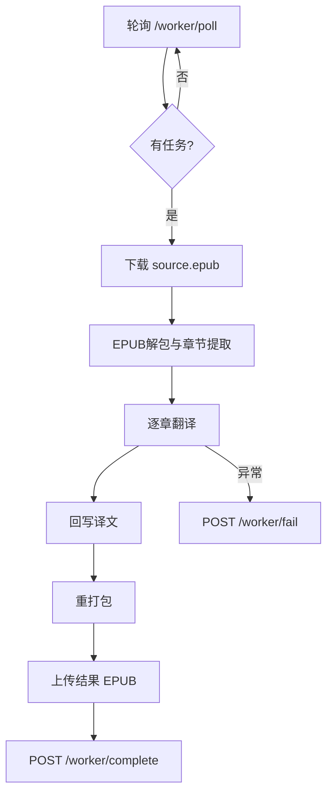
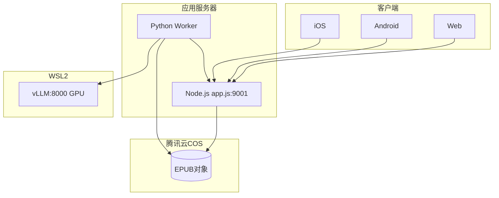

## 目录

1. 软件概述
2. 系统架构
3. 核心流程
4. 模块设计
5. 数据结构与存储
6. 接口规格
7. 部署与运行
8. 用户操作说明
9. 异常处理与追溯
10. 提交声明

---

## 1. 软件概述

灵译（AirTranslate）用于 EPUB 电子书的智能翻译处理，支持机器翻译与大模型翻译两类引擎，提供“任务创建—上传—手动启动—排队翻译—进度追踪—结果下载”的完整业务闭环。

系统组成如下：
- Flutter 客户端（Web / Android / iOS）
- Node.js 服务端（任务编排、积分与队列）
- Python Worker（EPUB 处理与翻译执行）
- vLLM 推理服务（GPU）
- Tencent COS（源文件与结果文件对象存储）

---

## 2. 系统架构

### 图 2-1 系统总体架构图



### 图 2-2 系统分层职责图



### 架构职责表

| 层级 | 组件 | 职责 |
|---|---|---|
| 表示层 | Flutter 客户端 | 任务创建、上传、手动启动、进度展示、下载 |
| 业务编排层 | Node.js 服务端 | 状态机管理、队列管理、积分扣费/退款、URL签发 |
| 执行层 | Python Worker | 轮询任务、EPUB 处理、翻译执行、结果回传 |
| 存储层 | 本地文件系统 + COS | 积分/任务本地持久化，EPUB 对象存储 |
| 推理层 | vLLM | 提供 AI 翻译推理接口 |

---

## 3. 核心流程

### 图 3-1 任务状态机



### 图 3-2 创建任务与手动启动时序图



### 图 3-3 Worker 执行流程图



### 图 3-4 失败退款流程图

```mermaid
flowchart LR
    A[任务状态 FAILED] --> B[/jobs/progress 查询]
    B --> C{_refunded?}
    C -- 否 --> D[按 pointsDeducted 退还积分]
    D --> E[写回 refundedPoints]
    C -- 是 --> F[直接返回进度]
```

---

## 4. 模块设计

### 4.1 服务端模块（`app.js`）

- 任务接口：`/jobs/create`、`/jobs/markUploaded`、`/jobs/start`、`/jobs/progress`、`/jobs/download`、`/jobs/list`、`/jobs/delete`
- 积分接口：`/billing/init`、`/billing/balance`、`/checkin`、`/checkin/status`
- Worker接口：`/worker/poll`、`/worker/progress`、`/worker/complete`、`/worker/fail`
- 存储：`data/points`、`data/jobs`、`data/queue`

### 4.2 Worker 模块（`worker/worker.py`）

- 轮询任务并领取执行单
- 基于 presign URL 下载/上传文件
- 调用 `epub_util.py` 完成 EPUB 解包、解析、回写、打包
- 调用 `translators.py` 执行 AI/机器翻译
- 回报状态与错误

### 4.3 翻译引擎模块（`worker/translators.py`）

- AI 翻译：vLLM OpenAI-compatible API
- `VLLM_MIN_OUTPUT_TOKENS` + `VLLM_MAX_OUTPUT_TOKENS` 动态控制输出长度
- 机器翻译：多引擎退避机制

### 4.4 客户端模块（Flutter）

- `api_service.dart`：API 访问 + 本地缓存
- `create_job_page.dart`：任务提交与文件上传
- `home_page.dart`：任务列表、手动启动、下载与删除
- `job_card.dart`：状态展示与动作入口

---

## 5. 数据结构与存储

### 5.1 本地文件结构

```text
data/
├─ points/
│  └─ {deviceId}.json
├─ jobs/
│  └─ {jobId}/
│     ├─ job.json
│     └─ progress.json
└─ queue/
   └─ {jobId}.json
```

### 5.2 COS 对象结构

```text
translate/{jobId}/source.epub
translate/{jobId}/bilingual.epub
translate/{jobId}/translated.epub
translate/{jobId}/glossary.json
```

### 5.3 关键实体

| 实体 | 字段 | 说明 |
|---|---|---|
| JobSpec | jobId, engineType, output, sourceLang, targetLang, charCount, pointsDeducted | 任务规格 |
| Progress | state, percent, chapterIndex, chapterTotal, refundedPoints, error | 执行状态 |
| PointsData | balance, initialGranted, lastCheckinDate, checkinStreak | 积分账户 |

---

## 6. 接口规格

### 6.1 App 接口

| 路径 | 方法 | 请求要点 | 返回要点 |
|---|---|---|---|
| `/jobs/create` | POST | 引擎、语言、字数、文件名 | jobId, uploadUrl, pointsDeducted |
| `/jobs/markUploaded` | POST | jobId | ok=true, state->READY |
| `/jobs/start` | POST | jobId | queued=true, state->UPLOADED |
| `/jobs/progress` | GET | jobId | state, percent, chapter进度 |
| `/jobs/download` | GET | jobId, output | 下载 presign URL |
| `/jobs/list` | GET | deviceId | jobs[] |
| `/jobs/delete` | POST | jobId | ok / refundedPoints |
| `/billing/init` | POST | deviceId | balance |
| `/billing/balance` | GET | deviceId | balance |
| `/checkin` | POST | deviceId | points, streak, balance |
| `/checkin/status` | POST | deviceId | checkedInToday, streak |

### 6.2 Worker 内部接口

| 路径 | 方法 | 说明 |
|---|---|---|
| `/worker/poll` | GET | 领取任务和 COS URL |
| `/worker/progress` | POST | 上报执行进度 |
| `/worker/complete` | POST | 标记完成 |
| `/worker/fail` | POST | 标记失败并触发退款逻辑 |

---

## 7. 部署与运行

### 图 7-1 部署拓扑图



### 7.1 最小运行步骤

1. 服务端配置 `.env`，启动 `node app.js`。
2. Worker 配置 `worker/.env`。
3. 在 WSL 启动 `worker/start_vllm.sh`。
4. Windows 可执行 `scripts/start.ps1 -StartVllm`。
5. 验证：`/health` 与 `http://localhost:8000/health`。

---

## 8. 用户操作说明

1. 进入首页点击“新建翻译”。
2. 选择 EPUB 文件并设置翻译参数。
3. 点击“提交翻译”完成任务创建与上传。
4. 返回列表点击“启动”，任务进入队列。
5. 观察进度直至完成。
6. 点击下载获取译文 EPUB 文件。

---

## 9. 异常处理与追溯

| 场景 | 处理 | 追溯字段 |
|---|---|---|
| 积分不足 | 返回 `POINTS_INSUFFICIENT` | need, balance |
| 翻译失败 | 置 `FAILED` 并记录错误 | progress.error |
| 失败退款 | 自动退回预扣积分 | refundedPoints, _refunded |
| 上传失败 | 提示重试，任务保持当前状态 | HTTP状态码 |

---

